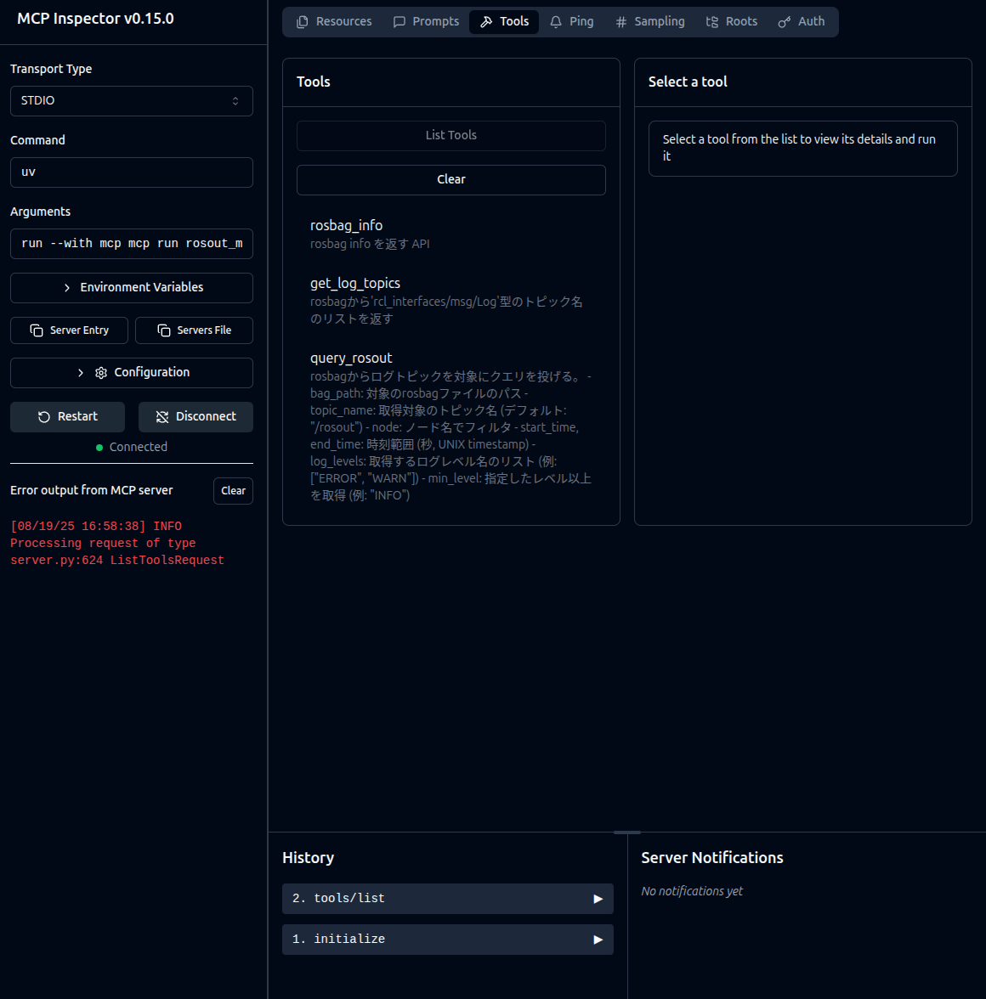

# ROS2 Rosout Log MCP Server

[](https://github.com/araitaiga/rosout_mcp/actions/workflows/test.yml)
[](https://codecov.io/gh/araitaiga/rosout_mcp)

A Model Context Protocol (MCP) server that loads ROS2 rosbag files containing log information, builds an in-memory database, and provides SQL-like querying capabilities for ROS2 rosout logs.

## Overview

This package provides:

- Load ROS2 rosbag files containing `/rosout` topic data
- Build an in-memory SQLite database for efficient querying
- Search and filter logs by time range, node name, log level, and message content

## Setup

### Run with Docker (Recommended)

#### Prerequisites

- **Docker**

#### Run Rosout MCP

To run the MCP server using the Docker Hub image, add the following to your `mcp.json` configuration:

```json
{
  "mcpServers": {
    "rosout_db_server": {
      "command": "docker",
      "args": [
        "run",
        "-i",
        "--rm",
        "--net=host",
        "--mount",
        "type=bind,src=${LOCAL_BAG_DIR},dst=${LOCAL_BAG_DIR},readonly",
        "araitaiga/rosout-mcp:latest"
      ]
    }
  }
}
```

**Note**: Replace `${LOCAL_BAG_DIR}` with the actual path to the directory containing your rosbag files.

<https://hub.docker.com/repository/docker/araitaiga/rosout-mcp/general>

### Run with uv

#### Prerequisites

- **Python**: >= 3.10
- **uv**
- **ROS2**

#### Install uv

```sh
curl -LsSf https://astral.sh/uv/install.sh | sh
```

#### Run Rosout MCP

Add this MCP server to your `mcp.json` configuration:

- If you use Jazzy (python: 3.12)  

```json
{
  "mcpServers": {
    "rosout_db_server": {
      "command": "uvx",
      "args": [
        "--python 3.12",
        "--from",
        "git+https://github.com/araitaiga/rosout_mcp",
        "rosout-mcp"
      ]
    }
  }
}
```

- If you use Humble (python: 3.10)

```json
{
  "mcpServers": {
    "rosout_db_server": {
      "command": "uvx",
      "args": [
        "--python 3.10",
        "--from",
        "git+https://github.com/araitaiga/rosout_mcp",
        "rosout-mcp"
      ]
    }
  }
}
```

## Usage

1. **Prepare your ROS2 application** with sufficient logging for runtime analysis
2. **Build and run** your ROS2 application
3. **Record rosout data**:

   ```sh
   ros2 bag record /rosout
   ```

4. **Use MCP client** to analyze the recorded data:
   - Example request: "Based on the rosbag output path from [your rosbag path], determine if there are any issues in the implementation of the node in this workspace."

## Available MCP Tools

- `rosbag_load`: Load ROS2 rosbag files into in-memory database
- `db_search`: Search logs with filters (time range, node, log level, message content)
- `db_status`: Get database statistics and information
- `node_list`: List all unique node names in the database
- `db_init`: Initialize/clear the in-memory database

## Debugging

For local development and debugging:

- To start using the local repository source code:  
[Required]: npm and node  

```sh
# clone rosout_mcp
cd /path/to/rosout_mcp
uv pip install -e .
npx @modelcontextprotocol/inspector uv run rosout-mcp
```

- To start using the GitHub source code:  
[Required]: npm and node  

```sh
npx @modelcontextprotocol/inspector uvx --from git+https://github.com/araitaiga/rosout_mcp rosout-mcp
```

- To start using Docker (Local Dockerfile)

```sh
cd /path/to/rosout_mcp/docker

# Build and run the MCP server
./build_run.sh

# Or run with specific options:
./build_run.sh inspector   # Start MCP inspector
./build_run.sh bash        # Start bash shell
```

- To start using Docker (Docker Hub)

```sh
# Pull the image from Docker Hub
# Start MCP inspector
LOCAL_BAG_DIR=/path/to/your/bag
docker run -it --net host --rm --name rosout-mcp-container \
  --mount type=bind,src=${LOCAL_BAG_DIR},dst=${LOCAL_BAG_DIR},readonly \
  araitaiga/rosout-mcp:latest \
  npx @modelcontextprotocol/inspector uvx --from git+https://github.com/araitaiga/rosout_mcp rosout-mcp
```

This will start the MCP inspector at `http://localhost:6274` where you can:

- Connect to the MCP server
- Test available tools



## Testing

Run the test suite:

```sh
uv run pytest
```
